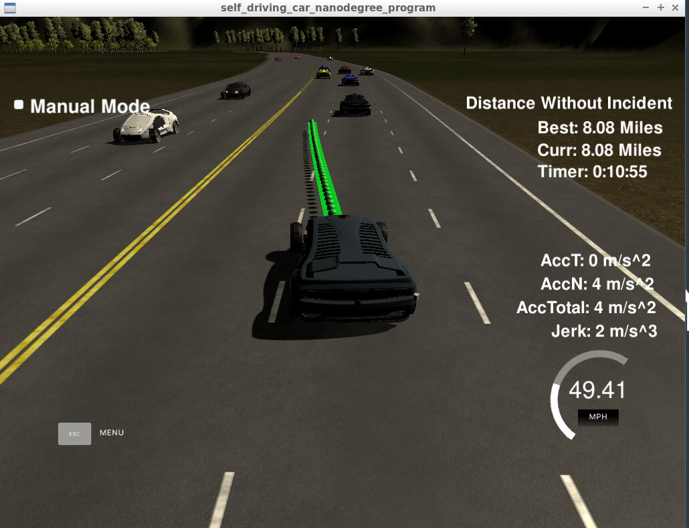
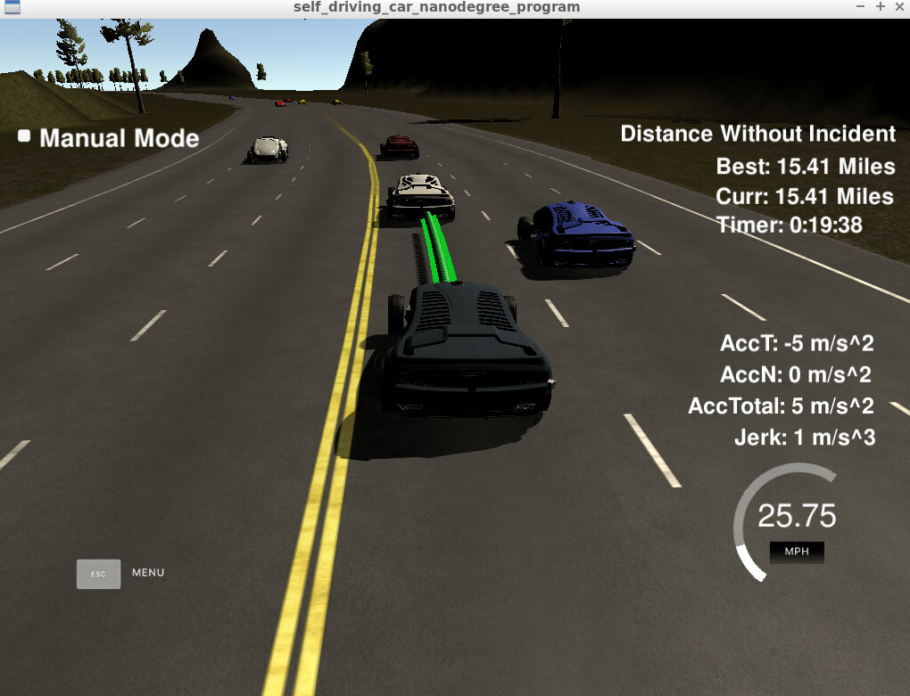

# CarND-Path-Planning-Project-P1
## Udacity Self-Driving Car Nanodegree - Path Planning Project



# Overview

In this project, we need to implement a path planning algorithms to drive a car on a highway on a simulator provided by Udacity([the simulator could be downloaded here](https://github.com/udacity/self-driving-car-sim/releases/tag/T3_v1.2)). The simulator sends car telemetry information (car's position and velocity) and sensor fusion information about the rest of the cars in the highway (Ex. car id, velocity, position). It expects a set of points spaced in time at 0.02 seconds representing the car's trajectory. The communication between the simulator and the path planner is done using [WebSocket](https://en.wikipedia.org/wiki/WebSocket). The path planner uses the [uWebSockets](https://github.com/uNetworking/uWebSockets) WebSocket implementation to handle this communication. Udacity provides a seed project to start from on this project ([here](https://github.com/udacity/CarND-Path-Planning-Project)).

# Prerequisites

The project has the following dependencies (from Udacity's seed project):

- cmake >= 3.5
- make >= 4.1
- gcc/g++ >= 5.4
- libuv 1.12.0
- Udacity's simulator.

For instructions on how to install these components on different operating systems, please, visit [Udacity's seed project](https://github.com/udacity/CarND-Path-Planning-Project). As this particular implementation was done on Mac OS, the rest of this documentation will be focused on Mac OS. I am sorry to be that restrictive.

In order to install the necessary libraries, use the [install-mac.sh](./install-mac.sh).

# Compiling and executing the project

In order to build the project there is a `./build.sh` script on the repo root. It will create the `./build` directory and compile de code. This is an example of the output of this script:

```
> sh ./build.sh
-- The C compiler identification is AppleClang 8.0.0.8000042
-- The CXX compiler identification is AppleClang 8.0.0.8000042
-- Check for working C compiler: /Library/Developer/CommandLineTools/usr/bin/cc
-- Check for working C compiler: /Library/Developer/CommandLineTools/usr/bin/cc -- works
-- Detecting C compiler ABI info
-- Detecting C compiler ABI info - done
-- Detecting C compile features
-- Detecting C compile features - done
-- Check for working CXX compiler: /Library/Developer/CommandLineTools/usr/bin/c++
-- Check for working CXX compiler: /Library/Developer/CommandLineTools/usr/bin/c++ -- works
-- Detecting CXX compiler ABI info
-- Detecting CXX compiler ABI info - done
-- Detecting CXX compile features
-- Detecting CXX compile features - done
-- Configuring done
-- Generating done
-- Build files have been written to: REPO_ROOT/CarND-Path-Planning-Project-P1/build
Scanning dependencies of target path_planning
[ 50%] Building CXX object CMakeFiles/path_planning.dir/src/main.cpp.o
[100%] Linking CXX executable path_planning
[100%] Built target path_planning
```

The project could be executed directly using `./build/path_planning`

```
> cd build
> ./path_planning
Listening to port 4567
```

# [Rubic](https://review.udacity.com/#!/rubrics/1020/view) points

## Compilation

### The code compiles correctly.

Add help functions in cmake configuration. A new file was added [src/spline.h](./scr/spline.h). It is the [Cubic Spline interpolation implementation](http://kluge.in-chemnitz.de/opensource/spline/): a single .h file you can use splines instead of polynomials. Algorithms added.

## Valid trajectories

### The car is able to drive at least 4.32 miles without incident.
I ran the simulator for 15 and 20 miles without incidents:



### The car drives according to the speed limit.
- No speed limit red message was seen.

### Max Acceleration and Jerk are not Exceeded.
- Max jerk red message was not seen.

### Car does not have collisions.
- No collisions.

### The car stays in its lane, except for the time between changing lanes.
- The car stays in its lane most of the time but when it changes lane because of traffic or to return to the center lane.

### The car is able to change lanes
- The car change lanes when the there is a slow car in front of it, and it is safe to change lanes (no other cars around) or when it is safe to return the center lane.

## Reflection

My main codes which include path planning algorithms could be separated into two parts, Traffic States and Behavior Planning. The trajectory generation is ussing a spline.h to insert waypoints between the start point and the end. I am not going to explain the trajectory generation because it is detailed in the Q&A video of Udacity classes. The details of Traffic States and Behavior Planning are presented below:


### Traffic States [line 249 to line 289](./src/main.cpp#L249)
This part of codes works on getting the traffic information using the sensor fusion data so that we can get the distance and lane information of other vehicles. To provide enough information for behavior planning, the codes at least deal with these items:
- Is the ego car too close to the leading car in our lane? 
  - If the distance is less than 15m, we consider the ego car is too close to the leading car.
- Is there a car to the right of us making a lane change not safe? 
  - If the leading car to the right of us is within 15m or the following car to the right of us is within 10m, we consider it is not safe to change lane to the right side.
- Is there a car to the left of us making a lane change not safe? 
  - If the leading car to the right of us is within 15m or the following car to the right of us is within 10m, we consider it is not safe to change lane to the right side.


### Behavior Planning [line 291 to line 315](./src/main.cpp#L291)
This part decides what kind of action should we take:
- What kind of arguments should we build?
  - The speed limit of the ego car: Make sure we will not violate the speed limit 50 mph.
  - The amount of speed change among the waypoints.
  - The maximum acceleration: Make sure we will not violate the Jerk limit. 
- If the leading car is too close to us in our lane: 
  - First option: change to the left side, pass the leading car if safe. If not safe, consider the second option.
  - Second option: change to the right side, pass the leading car if safe. If not safe, consider the third option.
  - Third option: decelerate with a constant acceleration.
- If we are not in the middle lane after passing a car:
  - Check if it is safe to change to right or left side.

This part of codes build a model for increasing or decreasing speed and build a driving logic that firstly pass the slow driving car and then come back to the middle lane without violating the Jerk and speed limits.

